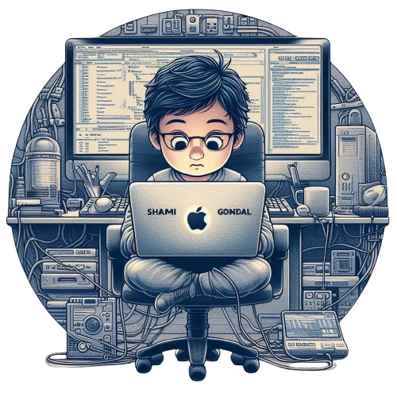

# 💫 About Me:

  

    
  

  

    
Hi 👋, I'm Ehtisham Ahmed Gondal

    
🔭 I’m currently Working on Web/Mobile apps

    
🌱 I’m currently Working on ML/Data Science projects

    
💬 Ask me about MERN, Next Js, Machine Learning, Data Science, React Native Expo, Flutter, C/C++, Next.js

    
📫 How to reach me ehtishamahmedgondal@gmail.com

    
📄 Know about my experiences <a href="https://shamigondal.online/">shamigondal.online</a>

  

## 🌐 Socials:
 

